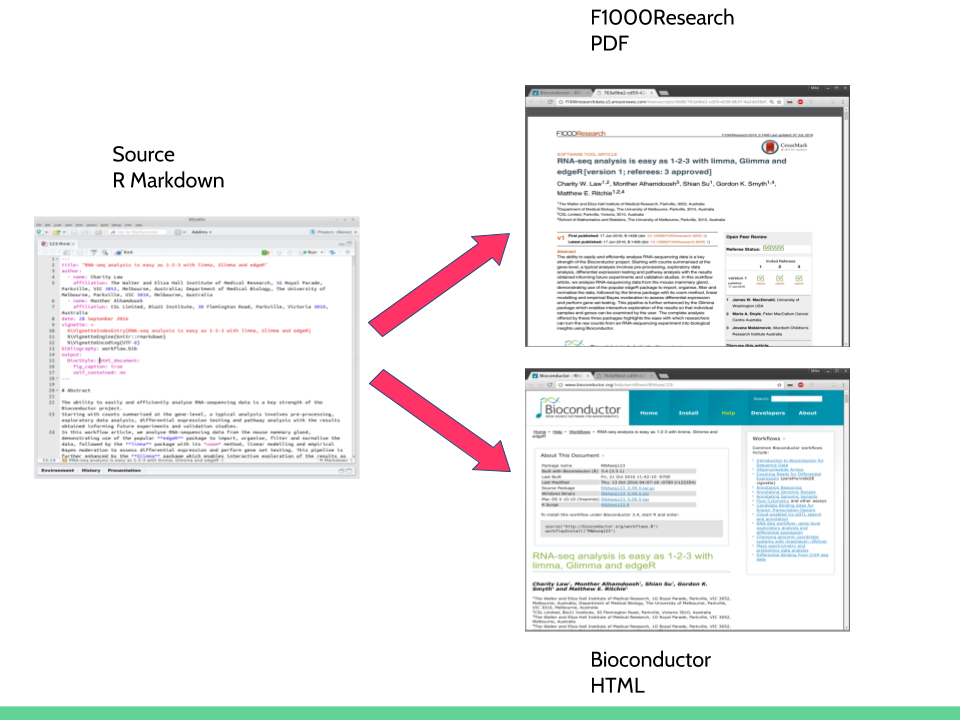

```{r setup, include=FALSE}
knitr::opts_chunk$set(echo = FALSE, fig.width = 2, dev = 'pdf')
```

## What is Markdown?

- Lightweight markup language
- Write text and 'tag' elements for formatting later
    - Similar to LaTeX or HTML, but much simpler
- Can be used to create many types of output
    
## What is Markdown?

- Lightweight markup language
- Write text and 'tag' elements for formatting later
    - Similar to LaTeX or HTML, but much simpler
- Can be used to create many types of output

- Time for a live demo
    - `example_1-layout.md`

## What is R Markdown?

- Basically **R** + Markdown
- You can include blocks of code 

## What is R Markdown?

- Basically **R** + Markdown
- You can include blocks of code 

- Allows you to keep in a single document:
    - Code 
    - Explainatory text
    - Output e.g. tables, figures
    
## Vignette examples 

## Literate Programming & Live Documents

> "The main idea is to regard a program as a communication to human beings rather than as a set of instructions to a computer." - Donald Knuth

- Combines ‘human readable’ prose with source code in a single document
- Analyses can be easily understood and repeated
- Facilitates repeatable research by allowing workflows to be regularly tested for robustness over time

## Repeatability vs Reproducibility

- Can you get my results from my data?

## How can R Markdown help?

- How often do you have code/ideas/figures spread across multiple files?
- An example
    - https://doi.org/10.1186/1471-2105-11-208
- Look at Supplementary File 2

## R Code Chunks

- `example_2-codechunks.Rmd`
- `example_3-chunkOptions.Rmd`
- `example_4-simplePipeline.Rmd`

## `sessionInfo()`

- Just because you can run a script later, doesn't mean it gives the same answers!
    - R changes
    - Packages change
    - Locale settings etc
    
## Publishing with R Markdown

## Bioconductor Workflows

- Educational documents detailing how to use multiple packages
- Regularly checked on Bioconductor servers
    - Ensures changes in component tools are identified quickly
    - Allows rapid updates by author
    - Provides users a platform to easily access the complete suite of tools
- Difficult to get credit 
    
## F1000Research

- F1000Research provides a citable, peer-reviewed publication platform
- Intention is for the same document to be submitted to both platforms - updates are possible


## BiocWorkflowTools

```{r, eval = FALSE, echo = TRUE}
source("https://bioconductor.org/biocLite.R")
biocLite("BiocWorkflowTools")
```

## Conclusions

- R Markdown is great for:
    - Lab book / journal recording
    - Reports
    - Supplementary materials
    
- As a princple document for journal articles - we're not there yet!

## Acknowledgements

|      |
|-------------|
| Andrzej Oles |
| Wolfgang Huber |
| Mike Love |
| Bernd Klaus |

```{r, eval=TRUE, echo=FALSE, out.width='33%', fig.align='center'}
knitr::include_graphics(c('deNBI_Logo_rgb.jpg',
                          'embl-logo.jpg',
                          'f1000research.jpg'))
```


