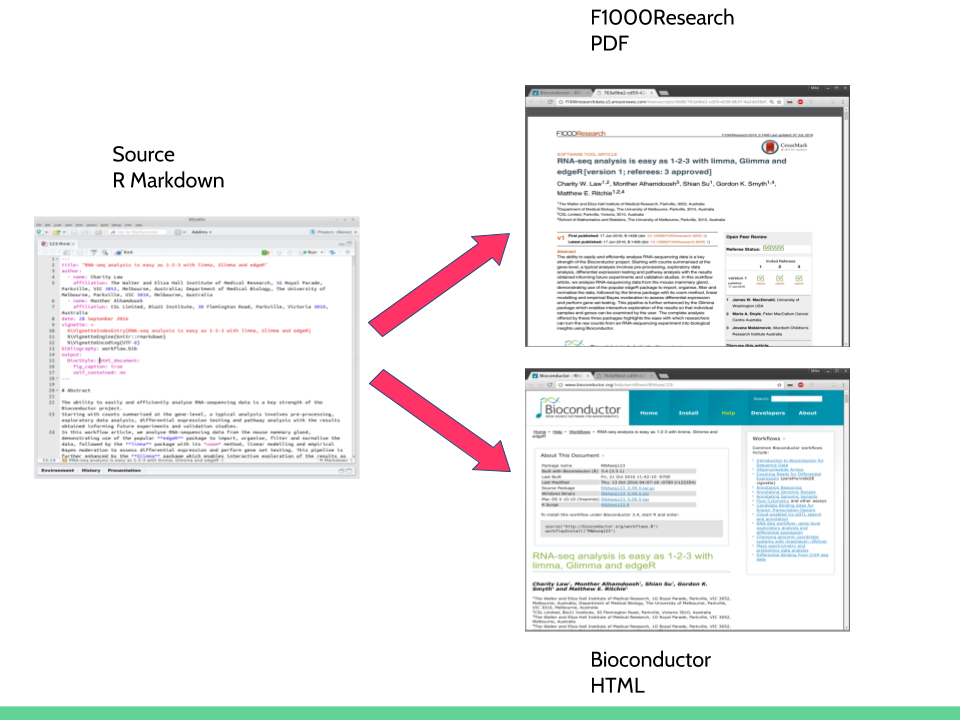

```{r setup, include=FALSE}
knitr::opts_chunk$set(echo = FALSE, fig.width = 2, dev = 'pdf')
```


## Bioconductor Workflows

- Educational documents detailing how to use multiple packages
- Regularly checked on Bioconductor servers
    - Ensures changes in component tools are identified quickly
    - Allows rapid updates by author
    - Provides users a platform to easily access the complete suite of tools
- Difficult to get credit 
    
## F1000Research

- F1000Research provides a citable, peer-reviewed publication platform
- Intention is for the same document to be submitted to both platforms - updates are possible


## BiocWorkflowTools

```{r, eval = FALSE, echo = TRUE}
source("https://bioconductor.org/biocLite.R")
biocLite("BiocWorkflowTools")
```

## Conclusions

- R Markdown is great for:
    - Lab book / journal recording
    - Reports
    - Supplementary materials
    
- As a princple document for journal articles - we're not there yet!

## Acknowledgements

|      |
|-------------|
| Andrzej Oles |
| Bernd Klaus |
| Wolfgang Huber |

```{r, eval=TRUE, echo=FALSE, out.width='33%', fig.align='center' }
knitr::include_graphics(c('deNBI_Logo_rgb.jpg',
                          'embl-logo.jpg',
                          'f1000research.jpg'))
```


